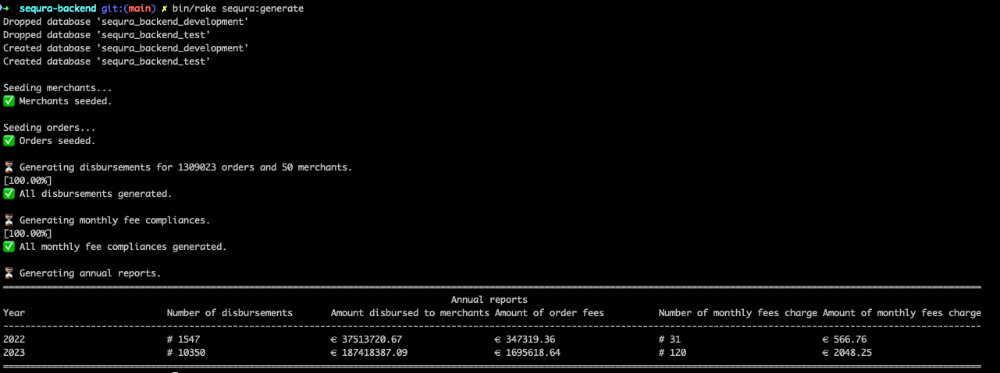

# seQura Backend Code Challenge

## How to Run the App ▶️

This application is built using **Ruby 3.4.2** and **PostgreSQL** as DB so be sure you have them installed.

To run it:
1.	Clone the repository
2.	Install dependencies using `bundle install`
3.  Run `bin/rake sequra:generate` to: 
    1. Drop and recreate the database.
    2. Seed merchants and orders this can take a bit since it has to load merchants and orders from the CSV.
    3. Generate all disbursements and monthly fee compliance data
    4. Compute and print the annual report to the console.

Tests can be run using `bundle exec rspec test`, I've tried to cover most of the edge cases and business rules, but I'm sure that with more time I could have added more tests.

#### <ins>Additional rakes</ins>
I've created different rakes tasks that can be helpful fot the purpose of the challenge:
1. `bin/rake sequra:generate` - Already described above.
2. `bin/rake disbursements:generate_all` - To generate all disbursements for the merchants.
3. `bin/rake disbursements:destroy_all` - To destroy all disbursements.
4. `bin/rake disbursements:regenerate_all` - To combine the previous two tasks and regenerate all disbursements.
5. `bin/rake monthly_fee_compliances:generate_all` - To generate the monthly fee compliances for the merchants.
6. `bin/rake monthly_fee_compliances:destroy_all` - To destroy all monthly fee compliances.
7. `bin/rake monthly_fee_compliances:regenerate_all` - To combine the previous two tasks and regenerate all monthly fee compliances.
8. `bin/rake annual_reports:generate_all` - To generate the annual reports.
9. `bin/rake annual_reports:destroy_all` - To destroy all annual reports.
10. `bin/rake annual_reports:regenerate_all` - To combine the previous two tasks and regenerate all annual reports.

---
## Personal Thoughts About the Challenge 🤔

#### <ins>Why Rails and don't go with plain Ruby?</ins>
I initially started (literally) with a plain Ruby implementation to maintain minimalism, but I _"quickly"_ (after **two** days of coding 😬) realized that Rails provided significant advantages:
- the data has strong relations between the models and I need a way to query in a fast way, looping through all the data was not the best approach.
- I have to think at the big picture here, you clearly used the word "real-world scenario" different times in the challenge description, and I think that Rails is a better fit for this.
- Rails is very scalable, and I can easily add new features in the future.
- Rails offers powerful tools to debug and test the code.

For all these (I'm sure I'm missing few more) reasons, Rails is a better long-term fit.

---

## Doubts 🙄
In the challenge description I can read:
> _"Ask any question to us (the hiring team) if something is unclear, ideally, as you would to stakeholders in a real-world scenario."_

That's exactly what I did with Ramon (hiring team) I had the following doubts:
1. in case the merchant has no orders, should I create an (empty) disbursement for them? The answer was no.
2. in the description the disbursement process "must occur daily" should be completed before 8am "including only merchants eligible for disbursement that day", this is a bit confusing in my opinion because the orders that arrives after 8am are outside the scope; the stakeholders told me that we should run the process for the day before so all the orders of that day would be included, exactly what I thought, happy days!

---

## My Assumptions 🕵️‍♂️
I assumes some things from the description of the challenge:

#### <ins>The daily job</ins>
I didn't implement the code to run daily the job (not even the ones that should run monthly or yearly), sorry I have no time to do that but let me share with you what would have been my approach, I see two options here:
1. use the `whenever` gem to schedule the job, this is a very common approach in Rails, I've already used it in the past and I think it would be a good fit here.\
In this case the cron generated would look like this:\
To generate the disbursements, let's do it at 2am every day:\
`0 2 * * * cd /path/to/your/rails/app && RAILS_ENV=<the_environment> bundle exec rake <my_rake>`\
To generate the monthly fee compliances, let's do it at 6am every first day of the month:\
`0 6 1 * * cd /path/to/your/rails/app && RAILS_ENV=<the_environment> bundle exec rake <my_rake>`\
To generate the annual report, let's do it at 10am every first day of the year:\
`0 10 1 1 * cd /path/to/your/rails/app && RAILS_ENV=<the_environment> bundle exec rake <my_rake>`
2. use the [active jobs](https://guides.rubyonrails.org/active_job_basics.html) I've prepared the code to run the jobs in the background, but I didn't have time to test it. Also you can run the jobs using a cron-ish approach!

#### <ins>The monthly fee compliance</ins>
For the computation of the monthly fee I cannot use the disbursements objects especially because of the "weekly" disbursements, maybe a disbursement for a weekly merchant has not been created yet, so I used the orders themselves.
Just retrieve all the orders for the merchant in the specific month and compute the monthly fee compliance based on that.

#### <ins>The rounding up to 2 decimals</ins>
In the challenge description I can read:
>_"Important note:\
Remember that we are dealing with monetary values, so calculations must be handled with precision. Always round up to two decimal places for every amount."_

I did what you suggest, but maybe would have been better to store into the db the real value and round it up only when we need to show it so the values would have been a bit more consistent inside the db.

Anyway I've created a concern to round up the values, but I didn't add it to each model, just to the `annual_report` model.

---

## The models 🧠

#### <ins>`merchants` Table</ins>

| Column Name             | Type     | Description                          |
|------------------------|----------|--------------------------------------|
| id                     | integer  | Merchant ID                          |
| email                  | string   | Merchant email address               |
| reference              | string   | Unique reference identifier          |
| live_on                | date     | Go-live date                         |
| disbursement_frequency | integer  | Disbursement frequency               |
| minimum_monthly_fee    | float    | Minimum monthly fee                  |
| created_at             | datetime | Record creation timestamp            |
| updated_at             | datetime | Record last update timestamp         |

---

#### <ins>`orders` Table</ins>

| Column Name               | Type     | Description                           |
|---------------------------|----------|---------------------------------------|
| id                        | integer  | Order ID                              |
| amount                    | float    | Order amount                          |
| order_received_at         | date     | Date the order was received           |
| merchant_id               | integer  | Associated merchant ID                |
| created_at                | datetime | Record creation timestamp             |
| updated_at                | datetime | Record last update timestamp          |
| disbursement_id           | integer  | Associated disbursement ID            |
| monthly_fee_compliance_id | integer  | Associated monthly fee compliance ID  |
---

#### <ins>`disbursements` Table</ins>

| Column Name           | Type     | Description                          |
|----------------------|----------|--------------------------------------|
| id                   | integer  | Disbursement ID                      |
| merchant_id          | integer  | Associated merchant ID               |
| disbursement_date    | date     | Date of disbursement                 |
| total_commission_fee | float    | Total commission fee                 |
| total_amount         | float    | Total order amount                   |
| disbursed_amount     | float    | Final disbursed amount to merchant   |
| created_at           | datetime | Record creation timestamp            |
| updated_at           | datetime | Record last update timestamp         |

---

#### <ins>`monthly_fee_compliances` Table</ins>

| Column Name                       | Type     | Description                            |
|----------------------------------|----------|----------------------------------------|
| id                               | integer  | Record ID                              |
| merchant_id                      | integer  | Associated merchant ID                 |
| period                           | date     | Fee compliance period                  |
| minimum_monthly_fee              | float    | Minimum monthly fee                    |
| total_commissions_fees_generated| float    | Total commission fees generated        |
| missing_amount                   | float    | Amount missing to reach minimum        |
| fee_due                          | boolean  | Whether fee is due                     |
| total_amount                     | float    | Total amount of relevant orders        |
| created_at                       | datetime | Record creation timestamp              |
| updated_at                       | datetime | Record last update timestamp           |

---

#### <ins>`annual_reports` Table</ins>

| Column Name                      | Type     | Description                             |
|----------------------------------|----------|-----------------------------------------|
| id                               | integer  | Report ID                               |
| from                             | date     | Start of reporting period               |
| until                            | date     | End of reporting period                 |
| year                             | integer  | Year of report                          |
| number_of_disbursements          | integer  | Total number of disbursements           |
| amount_disbursed_to_merchants    | float    | Total amount disbursed to merchants     |
| amount_of_orders_commission_fee  | float    | Total amount of commission fees         |
| number_of_monthly_fees_charged   | integer  | Total number of monthly fees charged    |
| amount_of_monthly_fees_charged   | float    | Total amount of monthly fees charged    |
| created_at                       | datetime | Record creation timestamp               |
| updated_at                       | datetime | Record last update timestamp            |

> #### P.S.
> sometime we need to compute queries on tables that are very very big, like orders, so I've added indexes on columns there in order to make the queries faster!</ins>

#### <ins>The relationship between the models is as follows:</ins>
- A merchant has many orders.
- A merchant has many disbursements.
- A merchant has many monthly fee compliances.
  
- An order belongs to a merchant.
- An order belongs to a disbursement, this can be null, it will be set when the disbursement process will create the model.
- An order belongs to a monthly fee compliance, this can be null, it will be set when the monthly fee compliance process will create the model.
  
- A disbursement belongs to a merchant.
- A disbursement has many orders.
- We have unique index on the merchant_id and disbursement_date to avoid duplicates.
  
- A monthly fee compliance belongs to a merchant.
- A monthly fee compliance has many orders.
- We have unique index on the merchant_id and period to avoid duplicates.
  
- The annual report has a unique index on the year to avoid duplicates.

---

## What could I improve? 📔
For sure the testing, I'm not using fixtures at all, the code in the test is not a mess but I could have used some helper methods to make it cleaner.

Maybe there are other places where a DB index could be useful.

The deploy part using `kamal` of course!

Many other things probably!

---

## Annual reports
| Year | Number of disbursements | Amount disbursed to merchants | Amount of order fees | Number of monthly fees charged | Amount of monthly fees charged |
|------|--------------------------|----------------------------|----------------------|-------------------------------|------------------------------|
| 2022 | 1547                     | € 37513720.67              | € 347319.36          | 31                            | € 566.76                     |
| 2023 | 10350                    | € 187418387.09             | € 1695618.64         | 120                           | € 2048.25                           |

#### <ins>The output from the console</ins>

